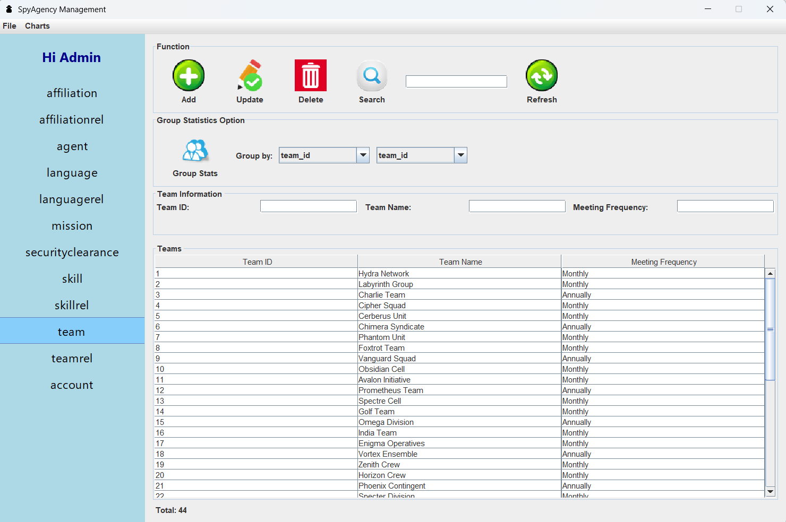

Author: Đường Tri Nhân  
Spy Agency2024 Management Software

Word and PowerPoint files are located in the "OOP subject report" folder.

SpyAgency2024 is an intelligence data management software developed in Java using the MVC architecture. It utilizes MySQL for data storage and JFreeChart for visualization. The application allows for managing agent information, organizations, affiliations, user accounts, and more.

---

## 🎯 Main Features

✅ Affiliation Management: add, edit, delete, search, refresh

✅ Affiliation Relationship Management: add, edit, delete, search, refresh

✅ Agent Management: add, edit, delete, search, refresh, group

✅ Language Management: add, edit, delete, search, refresh

✅ Language Relationship Management: add, delete, search

✅ Mission Management: add, edit, delete, search, refresh, group

✅ Security Clearance Management: add, edit, delete, search, refresh

✅ Skill Management: add, delete, search

✅ Skill Relationship Management: add, delete, search

✅ Team Management: add, edit, delete, search, refresh, group

✅ Team Relationship Management: add, delete, search

✅ User Account Management: add, edit, delete, search, refresh

✅ Statistical Charts

✅ Modern interface using Java Swing

---

## 🧱 Technologies Used

 Programming Lang: Java  
 GUI : JavaSwing  
 Architecture: MVC  
 DataBase: MySQL  
 Chart Library:  JFreeChart  

---

## 📂 Project Structure
Do_an_cuoi_ky_2/
├── src/
│ ├── model/
│ ├── view/
│ ├── controller/
│ ├── config/
│ ├── Charts/
│ ├── chartdao/
│ ├── dao/
│ └── icon/
├── images/
├── Database/
└── README.md

---

## ⚙️  Installation & Usage Guide  

I. **Required Software:**
 - Java JDK 8 or higher
 - MySQL Server
 - IDE Java (Eclipse, IntelliJ,...)
 - Required libraries: `mysql-connector-java`, `jfreechart`, `jcommon`(included in the code)
   
   
   
II. **Download Instructions **  
	Download the source code at: https://github.com/ChiNhonn/Do_an_cuoi_ky2.git
	
	
-	Link youtube: https://youtu.be/-VdsFRrMeCM
	
	
-	Kênh Nhơn Chi
	
	
III. **Database Setup:**
   - Open MySQL Workbench or phpMyAdmin
   - Run file: `Database/spy_agency.sql`
   - Or open XAMPP, go to http://localhost/phpmyadmin, Create a new database named spy_agency Import the spy_agency.sql file from the Database folder in the source code.

IV. **Open the project in Eclipse and build it. **
  	
   
 V. **Go to the view package and run the class loginInterface2.**
 
 Login credentials:
- Username: admin123
- Password: admin123

### login Inteface: 

### Register Interface:

### Dashboard :

   
   
### Feature 1:

   
### Feature 2:

### Feature 3:

### Feature 4:

### Feature 5:

### Feature 6:

### Feature 7:

### Feature 8:

### Feature 9:

### Feature 10:

### Feature 11:

### User Account Management :

### Chart Interface 1 :

### Chart Interface 2:

### Chart Interface 3:

### Chart Interface 4:

### Chart Interface 5:

### Chart Interface 6:

